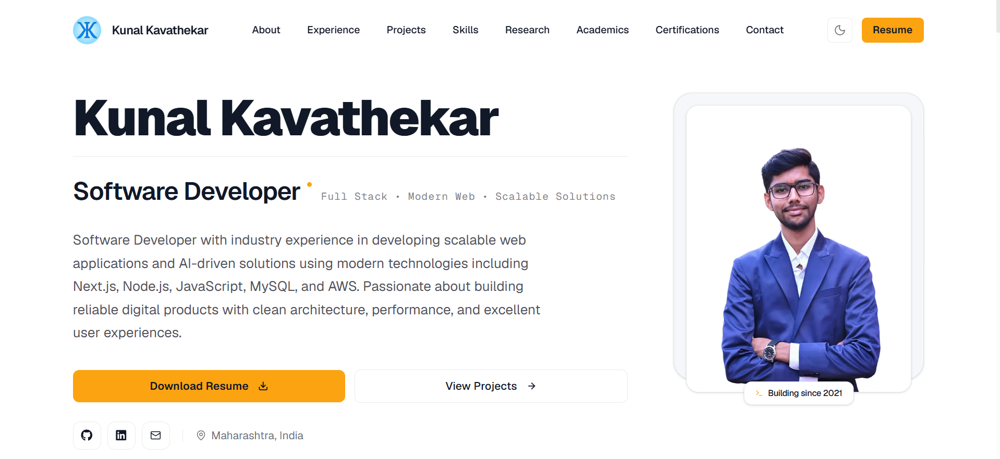

<div align="center">
  <br />
  <h1>Kunal Kavathekar Portfolio</h1>
  <p>A modern portfolio built to showcase software development experience, projects, research, and professional growth.</p>

  <a href="https://kunalkavathekar.vercel.app" target="_blank">
    <strong>🚀 Visit Portfolio</strong>
  </a>
  <br />
  <br />

[](#)
[](#)
[](#)
[](#)
[](#)

</div>

---

## Preview



## 🌟 Overview

Welcome to the repository of my personal portfolio website.

This portfolio serves as a central hub for my technical journey, showcasing my full-stack development projects, academic research, and industry experience. Built with a strong focus on responsiveness, usability, and modern web development practices, the interface provides a clean, accessible, and highly optimized experience across all devices. The design philosophy relies on elegant typography, subtle animations, and a structured layout to present complex information clearly.

## 🌐 Live Website

https://kunalkavathekar.vercel.app

## 💡 Key Highlights

- **7 Months of Industry Experience**: Proven track record in professional software development.
- **Published Research Paper**: Academic contribution to the field.
- **Published Patent**: Recognized intellectual property.
- **Registered Copyright**: Legally registered technical work.
- **Full Stack Development Projects**: Comprehensive showcase of real-world applications.
- **Responsive Design**: Pixel-perfect on mobile, tablet, and desktop.
- **Dark & Light Mode Support**: Seamless thematic switching.
- **Academic Achievements and Certifications**: Documented continuous learning and milestones.

## 🎯 Why This Portfolio?

The purpose of this portfolio is to provide a comprehensive look into my technical growth and professional experience. Beyond just a resume, it serves as a live demonstration of my coding capabilities, highlighting my projects, research, and achievements in an interactive format. By creating a clean and accessible user experience, I aim to show not just what I've built, but how much I care about code quality, performance, and user-centric design.

## ✨ Features

- **Responsive Design**: Pixel-perfect layouts fully optimized for mobile (320px+), tablet, and ultra-wide desktop displays.
- **Dark / Light Mode**: Beautiful thematic switching utilizing custom CSS properties and semantic color tokens.
- **Professional Project Showcase**: Deep dive into technical projects featuring interactive cards, tech stack tags, and direct links.
- **Research & Intellectual Property**: Dedicated showcase for published research papers, patent publications, and copyright registrations.
- **Academics & Achievements**: Timeline of educational history combined with distinguished awards and recognitions.
- **Certifications Gallery**: Interactive modal gallery displaying certifications.
- **Smooth Navigation**: Fluid Framer Motion transitions and intersection observers for a highly polished scrolling experience.
- **Resume Integration**: Direct 1-click download access to the latest professional resume.

## 🛠️ Tech Stack

This project is built using modern, industry-standard web technologies:

- **Framework**: [Next.js](https://nextjs.org/) (App Router)
- **Library**: [React](https://react.dev/)
- **Language**: JavaScript / JSX
- **Styling**: [Tailwind CSS](https://tailwindcss.com/)
- **Animations**: [Framer Motion](https://www.framer.com/motion/)
- **Icons**: [Lucide React](https://lucide.dev/) & React Icons
- **Deployment**: [Vercel](https://vercel.com/)

## 📂 Sections Included

The portfolio flows chronologically through the following components:

1. **Hero**: High-impact introduction, and primary calls to action.
2. **About**: Personal background, professional philosophy, and core objectives.
3. **Experience**: Career timeline detailing roles, responsibilities, and key deliverables.
4. **Projects**: Categorized grid (Professional vs. Personal) of full-stack software applications.
5. **Research & Intellectual Property**: Academic papers, patents, and technical copyrights.
6. **Academics & Achievements**: Educational journey and notable technical accolades (e.g., Hackathons).
7. **Certifications**: Professional continuous learning credentials.
8. **Contact**: Responsive communication gateway with direct email, phone, and social links.

## 🚀 Project Highlights

- **Custom CSS Architecture**: Built on top of Tailwind CSS with a highly semantic, custom color variable system (`globals.css`) ensuring flawless dark/light transitions.
- **Component Reusability**: Strict adherence to DRY principles. Custom UI primitives (`Button`, `SectionHeading`, `Container`) ensure universal design consistency.
- **Performance Optimized**: Lazy-loaded images, optimized Framer Motion viewports (`whileInView`), and heavily refined DOM structures ensure a flawless 60fps scrolling experience.
- **Complex Grid Layouts**: Advanced CSS Grid techniques handling asymmetrical multi-column tablet and mobile fallbacks.

## 📁 Folder Structure

```text
kunal-kavathekar-portfolio-v2/
├── public/                 # Static assets (images, resume pdf)
├── src/
│   ├── app/                # Next.js App Router (layout, page, globals.css)
│   ├── components/
│   │   ├── layout/         # Global layout components (Navbar, Footer)
│   │   ├── sections/       # Primary page sections (Hero, About, Projects, etc.)
│   │   └── ui/             # Reusable UI primitives (Buttons, Modals, Containers)
│   ├── data/               # Static JSON/JS data arrays powering the UI
│   ├── hooks/              # Custom React hooks (e.g., useTheme)
│   └── lib/                # Utility functions (Tailwind merge, etc.)
├── eslint.config.mjs       # ESLint configuration
├── next.config.mjs         # Next.js configuration
├── package.json            # Dependencies and scripts
├── postcss.config.mjs      # PostCSS configuration
└── README.md               # Project documentation
```

## ⚙️ Installation & Local Setup

To run this project locally, follow these steps:

1. **Clone the repository:**

   ```bash
   git clone https://github.com/Kunalsk36/kunal-kavathekar-portfolio-v2.git
   ```

2. **Navigate to the project directory:**

   ```bash
   cd kunal-kavathekar-portfolio-v2
   ```

3. **Install dependencies:**

   ```bash
   npm install
   ```

4. **Start the development server:**
   ```bash
   npm run dev
   ```
   _The application will start on `http://localhost:3000`_

## 🏗️ Build for Production

To create an optimized production build:

```bash
npm run build
npm start
```

## 🌐 Deployment

This application is continuously deployed via **Vercel**. Every push to the `main` branch triggers an automatic production build.

**Live URL:** [https://kunalkavathekar.vercel.app](https://kunalkavathekar.vercel.app)

## 📱 Performance & Responsiveness

Great care was taken to ensure universal accessibility and responsiveness:

- **Desktop Optimized**: Full utilization of ultra-wide displays with max-width containers and complex multi-column grid layouts.
- **Tablet Optimized**: Graceful degradation into 2-column arrays, heavily relying on responsive `md:` breakpoints and dynamic odd-item centering.
- **Mobile Optimized**: Strictly enforced single-column flows, robust text-wrapping, comfortable touch targets, and compact spacing to eliminate scroll fatigue.

## 👨‍💻 Author

**Kunal Kavathekar**  
_Software Developer | Full Stack Developer_

- **Portfolio**: [https://kunalkavathekar.vercel.app](https://kunalkavathekar.vercel.app)
- **GitHub**: [@Kunalsk36](https://github.com/Kunalsk36)
- **LinkedIn**: [kunal-kavathekar](https://www.linkedin.com/in/kunal-kavathekar)
